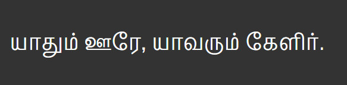

#### *Work in progress*

# Pavanam

Pavanam is a Tamil typeface designed with the focus of greater legibility in smaller sizes on screen and print. Latin counterpart is derived from Vernon Adam's [Pontano Sans](https://www.google.com/fonts/specimen/Pontano+Sans), and slightly modified to match with the Tamil typeface design metrics.

Pavanam means wind, in Tamil.

## Getting Involved

Here is how **you** can help and contribute to the development of Neythal font.

1. Tell me about any bugs you find, or enhancements you would like to see

2. Contribute directly to the font. Complete set of source files are available in this repository as UFO files.

### Bug Reports & Glyph requests

Send me bug reports, feature enhancements or glyph requests, using the [Github Issue Tracker](https://github.com/enathu/pavanam/issues/).

## License

Pavanam Font Software is licensed under the SIL Open Font License, Version 1.1. This license is available with a FAQ at: [http://scripts.sil.org/OFL](http://scripts.sil.org/OFL)